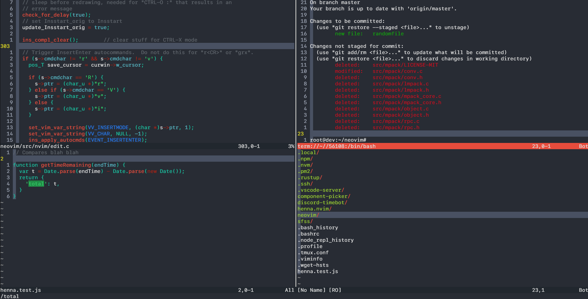

# henna.nvim
Henna theme loosy ported to neovim using [tjdevries/colorbuddy.nvim](https://github.com/tjdevries/colorbuddy.nvim)



## Installation (Plug and VimScript)

```vim
call plug#begin()
" ...
Plug 'tjdevries/colorbuddy.nvim'
Plug 'nyxkrage/henna.nvim'
" ...
call plug#end()

lua require('colorbuddy').colorscheme('henna')
```

## Installation (Packer and Lua)

```lua
require('packer').startup(function()
	-- ...
	use {
		'nyxkrage/henna.nvim',
		requires = {
			'tjdevries/colorbuddy.nvim'
		}
	}
	-- ...
end)

require('colorbuddy').colorscheme('henna')
```
